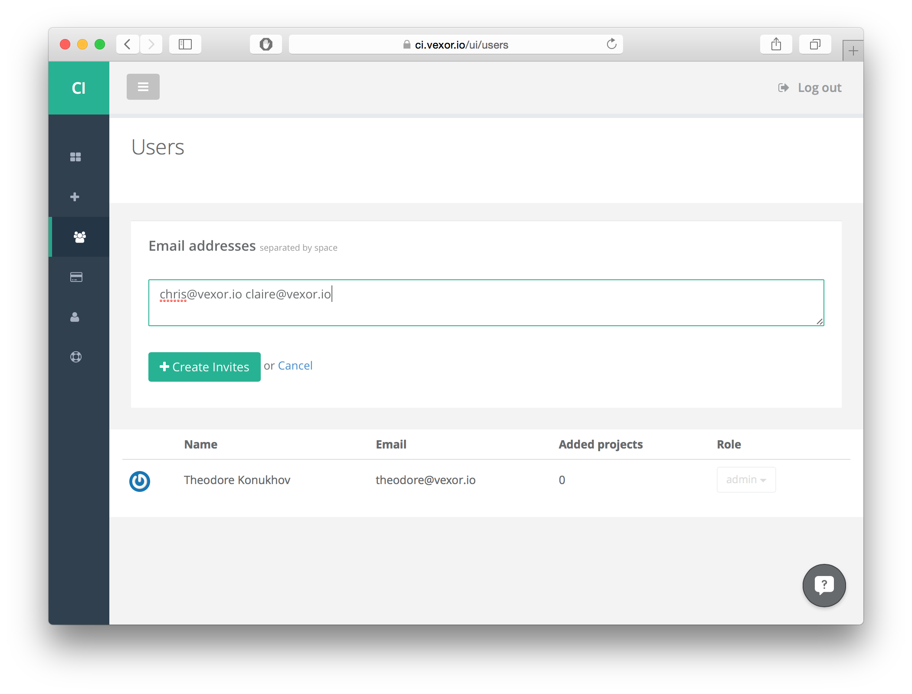
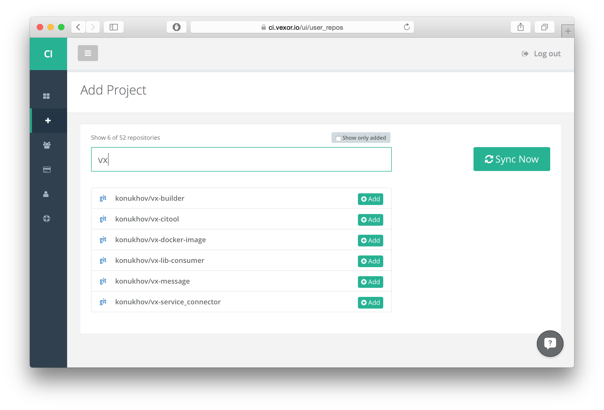
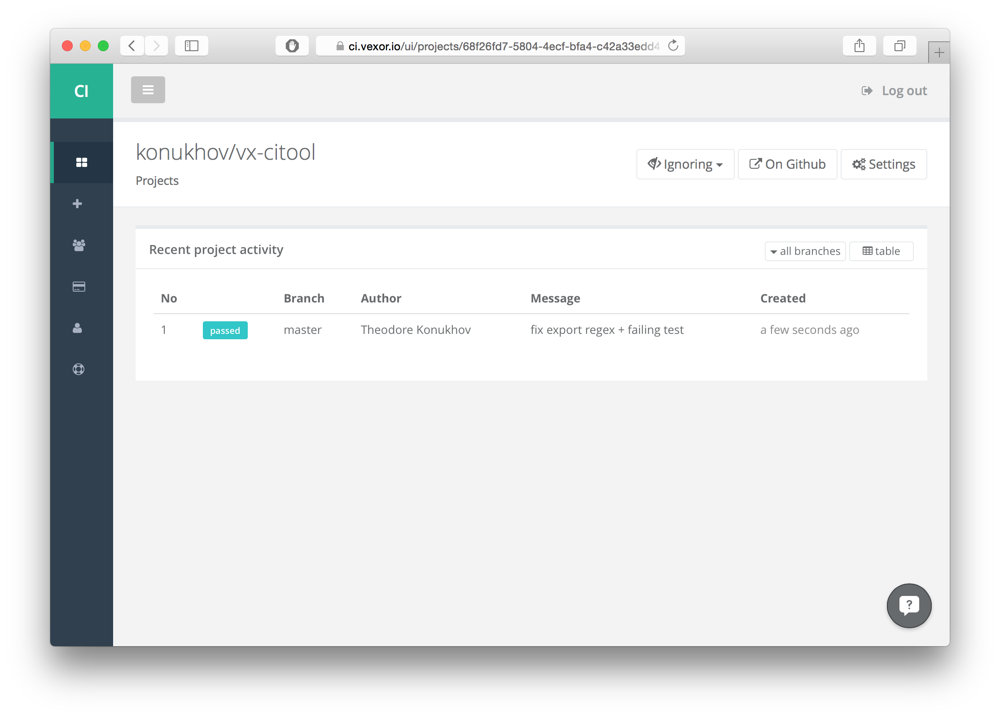
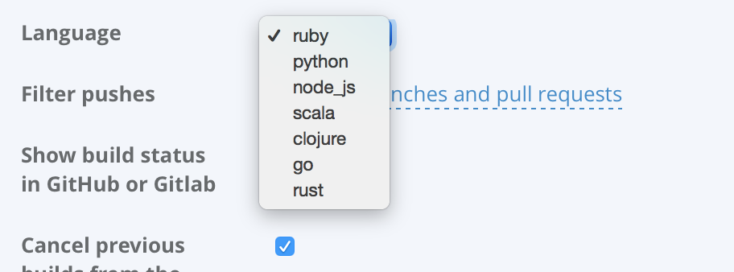
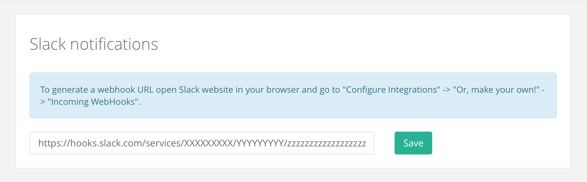
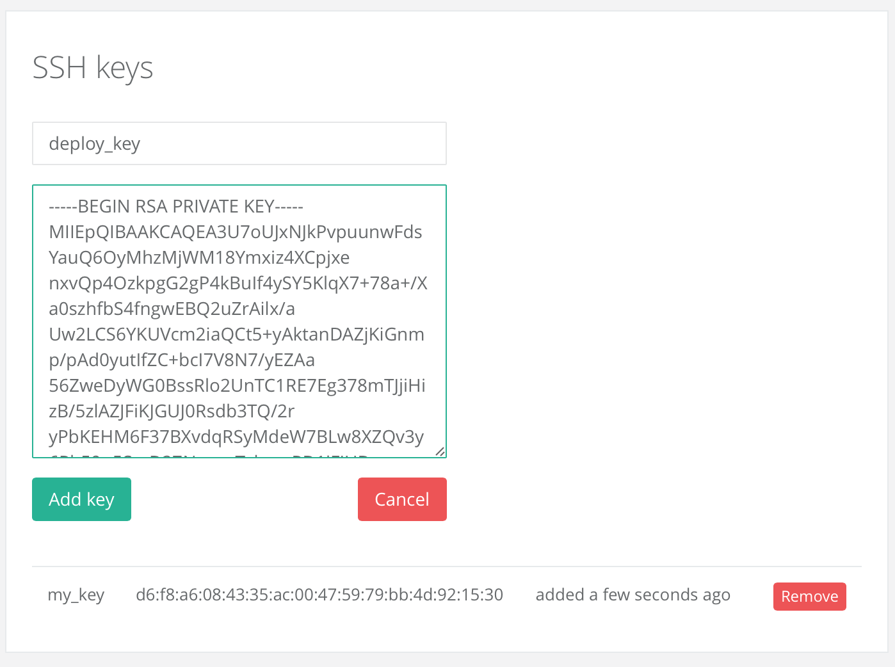
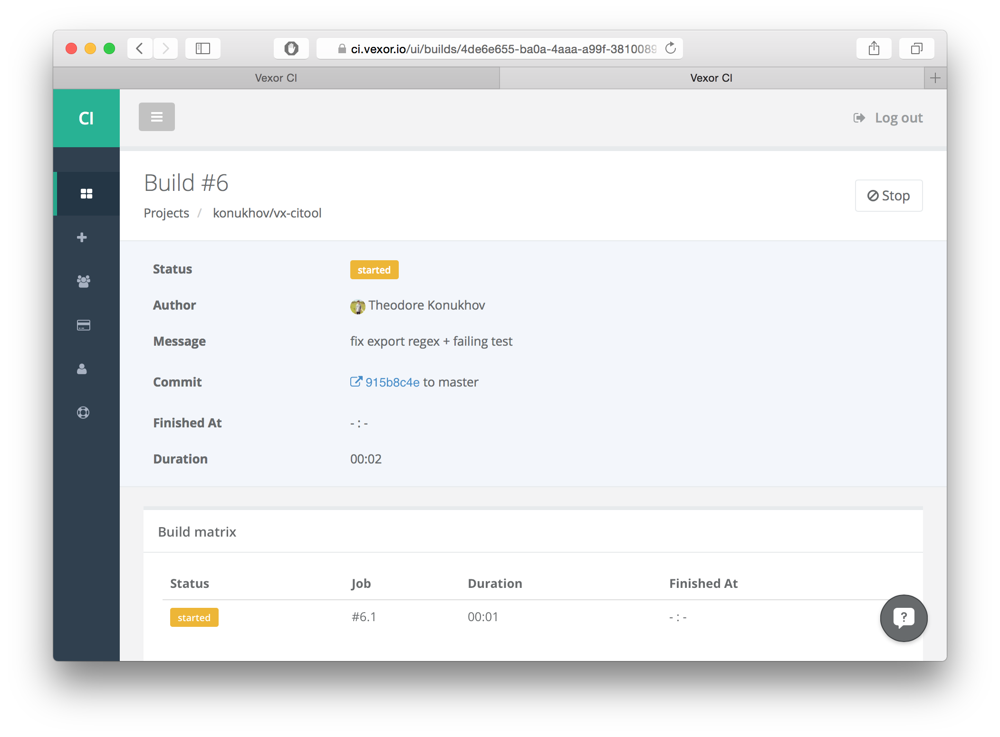
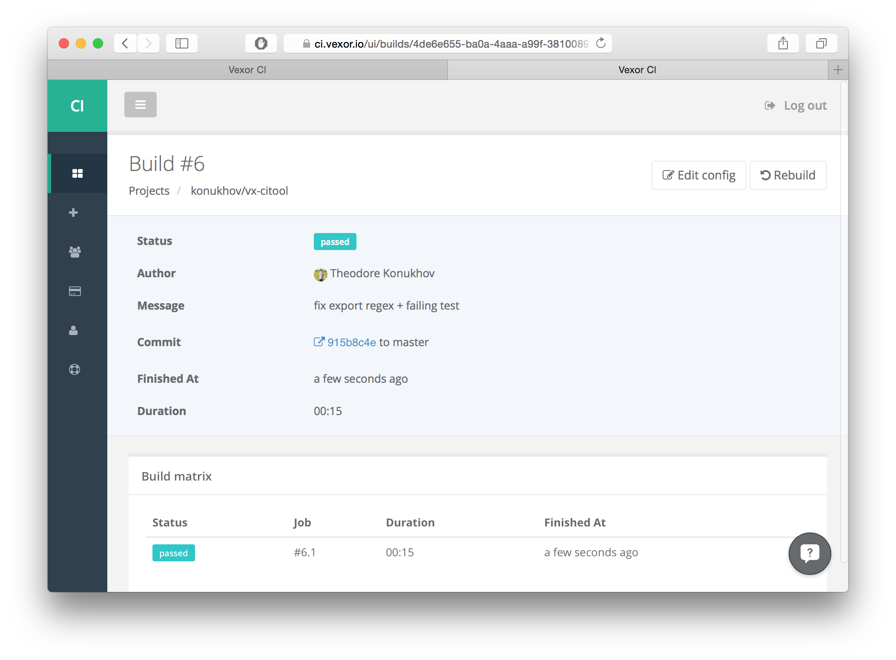
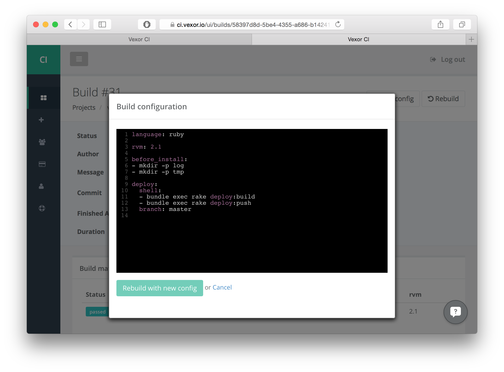
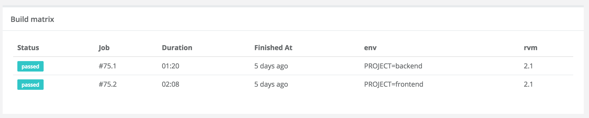

# Vexor Documentation

# Getting started with Vexor

## Registration

In order to start using Vexor you should have a GitHub or BitBucket account.


Vexor supports 3 popular source control providers: [GitHub](https://github.com), [BitBucket](https://bitbucket.org) and [GitLab](https://gitlab.com). No matter which one you've signed up with, you can always connect another, as well as update your email address and name, on the Profile Settings page.


## Team settings

Collaborators can be invited to your team on the "Users" page. Each user can be assigned with a role Admin or Developer. Developers cannot remove projects and users to the team.



## Adding a project

There's a list of all repos imported from your connected accounts in the "Add project" section.



To add a project and make a first build just press "Add". You'll be asked to specify a project's language while adding.


Then you'll be redirected to the freshly added project.



## Project notification settings

You can choose on which occasions you will be notified about your project's build statuses. There're three available options:

+ **Watching** (default): Get an email after each build is completed whther it's failed or succeeded.
+ **Not watching**: Get an email only if a build was initiated by your commit or pull request.
+ **Ignoring**: Don't get any emails about this project. 


## Project settings

Secure env variables, SSH keys and build restrictions can be configured on project's "Settings" page.


### Choosing project's language

Project's language can be changed here.



### Configuring build restrictions

You can specify which branches you want to be built by a regular expression in the "Filter pushes" popup. 


We don't build pull requests from the same repo by default, because builds are already being initiated by pushes to a repo. This behavior can be changed by clicking on a "Build pull requests" checkbox (e.g. if you have filtered some branches but want to build all PRs). Pull requests from foreign repos are being built always, whether "Build pull requests" checkbox is on or not.

### Configuring build statuses on GitHub or GitLab (no BitBucket, sorry)

Build statuses shown in pull requests could be configured here. Enabled by default. 


### Canceling running builds after a push to the same branch

You might want ongoing builds to get cancelled after a push to the same branch. Enabled by default.


### Configuring Slack notifications

Vexor can send build notifications to Slack channels. To enable this feature you should create an incoming webhook on the Slack integrations page and paste it to the "slack" section of the Vexor project settings page.



### <a id="project-settings-env-vars"></a>Securing environment variables

You can add secure environment variables to your project (e.g. Heroku tokens, Code Climate keys, etc.). Note that env-vars which don't have to be secure could also be added via `.vexor.yml` config file.


### Adding SSH keys

Additional SSH keys can also be added through the interface. Note that you might want to keep keys in a particular order. User-added SSH keys are being added to the agent before the project's deploy key, ordered from most recent to earliest.



## Vexor config file

Project's config should be stored in `vexor.yml` (`.vexor.yml` works too) file in a root directory. For those who are migrating from Travis it is possible to use `.travis.yml` file but it's recommended to switch to `vexor.yml` config, because Vexor is not fully compatible with Travis and uses slightly different configuration options.

### Available configuration keys

**Common options**
+ **language** *string*

  Specify a language so Vexor could run language-specific preparations for your project. If you don't have a Vexor config included in your repo's root, a default config will be used, which has only the `language` key based on a language you've chosen when added a repo to Vexor. If config file is empty, without language specified, your build won't we able to run.
  
  Example:

  ```yaml
  language: ruby
  ```

+ **env** *map*

  Set up your environment variables here. For secure env-vars see [Configuring project ENV variables](#project-settings-env-vars) section. Environment config consists of three sections: `global`, `exclude` and `matrix`.

  **Global**

  A list of global environment variables exported into the system.

  ```yaml
  env:
    global:
    - VAR1=some_stuff
    - VAR2="i'm a var with spaces"
  ```

  **Matrix**
  
  A list of martix-specific variables. For each variable there will be one job started with this var + all vars from `global` section exported. See [Parallelism](#parallelism) for better matrix understanding.
  
  ```yaml
  env:
    martix:
    - SCRIPT=script_for_one_job
    - SCRIPT=script_for_another_job
  ```

  **Exclude**
  
  Soon

  **Full example**

  ```yaml
  env:
    global:
    - RAILS_ENV=test
    - DATABASE_URL=postgresql://postgres@herokupgserver.com/my_database
    matrix:
    - SCRIPT="bundle exec rspec"
    - SCRIPT="bundle exec brakeman"
    - SCRIPT="bundle exec rubocop"

  ```
+ **before_install** *array*

  A list of commands called before installation stage.

  ```yaml
  before_install:
  - echo called before installing any dependencies
  - ... etc.
  ```

+ **install** *array*

  By default we install a number of packages depending on a language specified at the beginning of your config file, including a language binary itself. Use this option to override this behavior.

  ```yaml
  install:
  - sudo apt-get install -y ruby-build rbenv
  - rbenv install 2.1.2
  - gem install bundler
  - ... etc.
  ```

+ **database** *array*

  A list of database-related configuration.

  We already have Postgresql 9.3 (with postgres-contrib), MySQL 5.6, MongoDB 2.6.5 and Redis 2.8.5 installed in containers.

  **Using PostgreSQL**

  Postgres starts automatically in containers. Use `postgres` user to execute psql command.

  ```yaml
  database:
  - psql -U postgres -c "create database test;"
  ```

  **Using MySQL**

  MySQL is already running by default in containers. Use `root` user to call mysql queries.

  ```yaml
  database:
  – mysql -u root -e "create database test;"
  ```

  *Notice for Rails users*: by default we're already running all necessary database configuration to get Rails tests working so in most cases you don't have to write any database configuration at all. Use `database` config only if you want to override this behavior.

+ **before_script** *array*

  A list of commands called after installation and database stages but before running tests. Usually it's used to install additional dependencies when the system's environment's already configured (e.g you need to install additional gems etc.)

  ```yaml
  before_script:
  - sudo npm install bower
  - sudo gem install brakeman
  ```

+ **services** *array*

  Additional services you want to run in your container. For each specified service there will be `sudo service #{specified_service} start` command executed. [Here](https://github.com/vexor/vx-docker-image/tree/master/docker/trusty/playbooks/roles) you can see which services are already present in our image.
  
  **Note**: *There's an alias for `rabbitmq-server`. You could simply write `rabbitmq`.*

  ```yaml
  services:
  - rabbitmq
  - redis-server
  ```

+ **script** *string*

  You can override a command which runs tests. This might be useful together with `matrix` when you want to run your test in parallel.

  ```yaml
  script: bundle exec rspec
  ```
  
+ **chdir** *string*
  Your project's working directory. By default it's set to your repo's root directory (which is `~/vexor_org_name/project_name`).
  
  ```yaml
  chdir: ~
  ```
  
+ **timeout** *int*
  Job's maximum running time in seconds. Default is 1 hour.
  
  ```yaml
  timeout: 1800
  ```

+ **read_timeout** *int*

  If there wasn't any output within the read timeout (in seconds) a job will be shut down. 
  
  ```yaml
  read_timeout: 60
  ```

+ **cache** *boolean*
  
  Enable/disable dependencies caching. `True` by default.
  
  ```yaml
  cache: false
  ```

**Language versions**<a id="vexor-yml-language-versions"></a>

Each of these keys usually gets a list of language versions which you want to run tests against. If you specified env:matrix, there will be `versions_num * martix_size` jobs. See [Paralleism](#parallelism) for better understanding.

+ **rvm** *array*
+ **go** *array*
+ **jdk** *array*
+ **scala** *array*
+ **node_js** *array*
+ **python** *array*

Example:

```yaml
rvm:
- 1.9.3
- 2.0.0-p0
- 2.1.1
```

### Cancelling and restarting a build

#### Cancel a build

You can cancel any build by clicking a "Stop" button on a build page. A particular job cannot be stopped.



#### Restart a build

Any finished build can be restarted. 

If you want to restart a build without changing any build configuration, just click a "Rebuild" button on a build page.



In case you want to quickly test some configuration options out without commiting every `vexor.yml` change to a repo, you can use "Edit config" feature. Click "Edit config" button on a build page, modify your configuration and then click "Rebuild with new config" button. A new build will be created.




### Parallelism

One of the Vexor's main advantages is that it can run an unlimited amount of jobs in parallel. There're several ways to set up parallelim.

#### Running tests in parallel against different language versions.

You can specify different language versions (see [Language versions](#vexor-yml-language-versions) for details) in `vexor.yml` config file. For each version there will be a job started.

**Example:**

Config:

```yaml
rvm:
  - 2.1.0
  - 2.0.0
  - 1.9.3
  - rbx-2
```

Result:


#### Running different scripts for each job.

Parallel jobs can also be configured via `env:matrix` key in `vexor.yml` file. The basic idea is that you specify a script which depends on an environment variable and assign different values to this variable in the matrix section of a config file. Here's an example of how we're using this aproach to build the Vexor web app:

```yaml
env:
  matrix:
  - PROJECT=backend
  - PROJECT=frontend

script: bundle exec rake test:${PROJECT}
```

And here's a resulting build:



Here's another example of how to use matrix for build parallelization. We're gonna run Rspec, check security with Brakeman, check code quality with Rubocop and check our coffee, scss and haml files.

```yaml
env:
  matrix:
    - BUILD_CMD='rspec'
    - BUILD_CMD='rubocop'
    - BUILD_CMD='brakeman -z'
script: bundle exec ${BUILD_CMD}
```


#### Using language versions with a matrix.

"Matrix" and "language versions" approaches can be combined. A resulting build will be containing `versions_num * matrix_size` jobs.

Example:

```yaml
env:
  matrix:
  - TEST_SUITE=test
  - TEST_SUITE=cucumber
  
rvm:
- 2.2
- 2.1
- 2.0  
```

And the result is:


#### Parallel Rspec

There's another option for Rails users. You can specify a number of parallel jobs and set `script` to `parallel_rspec` to run automatically Rspec jobs in parallel.

```
parallel: 4
script: parallel_rspec
```

## Deploiyng your application

Soon.

+ Capistrano examples
+ Ansible examples

## SSHing into a build

Soon.

## Billing

Soon.

## FAQ

Soon.
